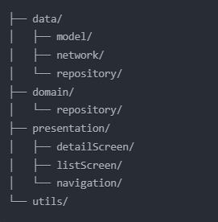

# PokeDexCompose with Jetpack Compose

A modern Android application built with Jetpack Compose showcasing Pokemon information using
PokeAPI.

## 📱 Screenshots


## ✨ Features

- Pokemon list with interactive UI
- Search by name or number
- Detailed Pokemon stats (HP, Attack, Defense)
- Physical characteristics display
- Material Design 3 implementation
- Dynamic theming based on Pokemon type

## 🛠️ Tech Stack

- Kotlin 2.0.0
- Clean Architecture + MVVM
- Jetpack Compose + Material 3 + Animation
- Dagger Hilt
- Retrofit + OkHttp
- Coil
- Navigation Compose
- Paging 3

## 📂 Project Structure



## 🚀 Getting Started

1. **Clone the repository**
   ```bash
   git clone https://github.com/Oguzhan94/PokedexCompose.git

2. **Open project in Android Studio**
3. **Complete Gradle sync**
4. **Run the application**

## 🏗️ Architecture

The app follows Clean Architecture with three layers:

- Data: API calls, models, repositories
- Domain: Business logic, interfaces
- Presentation: UI components, ViewModels

## 📚 API

Uses [PokeAPI](https://pokeapi.co/) for Pokemon data


